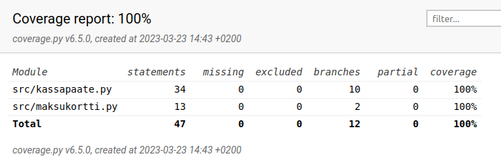

# Ohjelmistotekniikan harjoitustyö
Muotojen animointityökalu (inbetweening/tweening)
## Tehtäväpalautukset
### Viikko 1
* [gitlog](laskarit/viikko1/gitlog.txt)
* [komentorivi](laskarit/viikko1/komentorivi.txt)
### Viikko 2

[vaatimusmäärittely](dokumentaatio/vaatimusmäärittely.md)
[työaikakirjanpito](dokumentaatio/työaikakirjanpito.txt)
