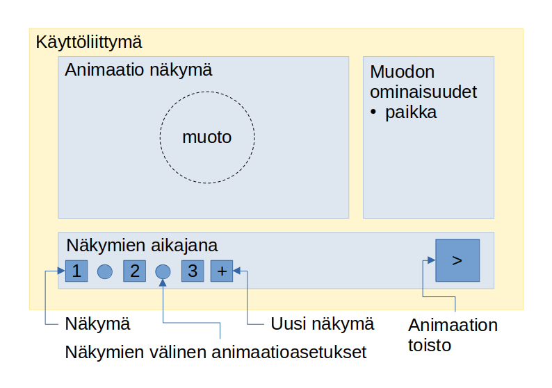

# Vaatimusmäärittely
## Sovelluksen tarkoitus
Sovellus on tarkoitettu muotojen animoimiseen määrittelemällä kaava, jolla muotovaihtaa paikkaa kahden sijainnin välillä.

## Toiminnallisuudet
- [ ] Näkymä muodon animaation katsomiselle
- [ ] Mahdollisuus näkyvän näkymän vaihtamiseen
- [ ] Kahden näkymän välisen muodonmuutoksen määrittäminen
- [ ] Animaation "toisto" eli animaation läpikäyminen

