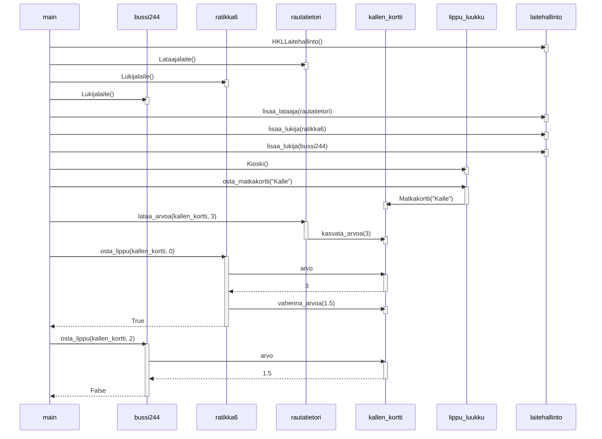

```mermaid
sequenceDiagram
	participant Main as main
	participant Bussi as bussi244
	participant Ratikka as ratikka6
	participant Rautatietori as rautatietori
	participant Kortti as kallen_kortti
	participant Luukku as lippu_luukku
	participant Laitehallinto as laitehallinto

	Main->>Laitehallinto: HKLLaitehallinto()
	activate Laitehallinto
	deactivate Laitehallinto
	Main->>Rautatietori: Lataajalaite()
	activate Rautatietori
	deactivate Rautatietori
	Main->>Ratikka: Lukijalaite()
	activate Ratikka
	deactivate Ratikka
	Main->>Bussi: Lukijalaite()
	activate Bussi
	deactivate Bussi
	Main->>Laitehallinto: lisaa_lataaja(rautatietori)
	activate Laitehallinto
	deactivate Laitehallinto
	Main->>Laitehallinto: lisaa_lukija(ratikka6)
	activate Laitehallinto
	deactivate Laitehallinto
	Main->>Laitehallinto: lisaa_lukija(bussi244)
	activate Laitehallinto
	deactivate Laitehallinto
	Main->>Luukku: Kioski()
	activate Luukku
	deactivate Luukku
	Main->>Luukku: osta_matkakortti("Kalle")
	activate Luukku
	Luukku->>Kortti: Matkakortti("Kalle")
	activate Kortti
	deactivate Kortti
	deactivate Luukku
	Main->>Rautatietori: lataa_arvoa(kallen_kortti, 3)
	activate Rautatietori
	Rautatietori->>Kortti: kasvata_arvoa(3)
	activate Kortti
	deactivate Kortti
	deactivate Rautatietori
	Main->>Ratikka: osta_lippu(kallen_kortti, 0)
	activate Ratikka
	Ratikka->>Kortti: arvo
	activate Kortti
	Kortti-->>Ratikka: 3
	deactivate Kortti
	Ratikka->>Kortti: vahenna_arvoa(1.5)
	activate Kortti
	deactivate Kortti
	Ratikka-->>Main: True
	deactivate Ratikka
	Main->>Bussi: osta_lippu(kallen_kortti, 2)
	activate Bussi
	Bussi->>Kortti: arvo
	activate Kortti
	Kortti-->>Bussi: 1.5
	deactivate Kortti
	Bussi-->>Main: False
	deactivate Bussi
```
