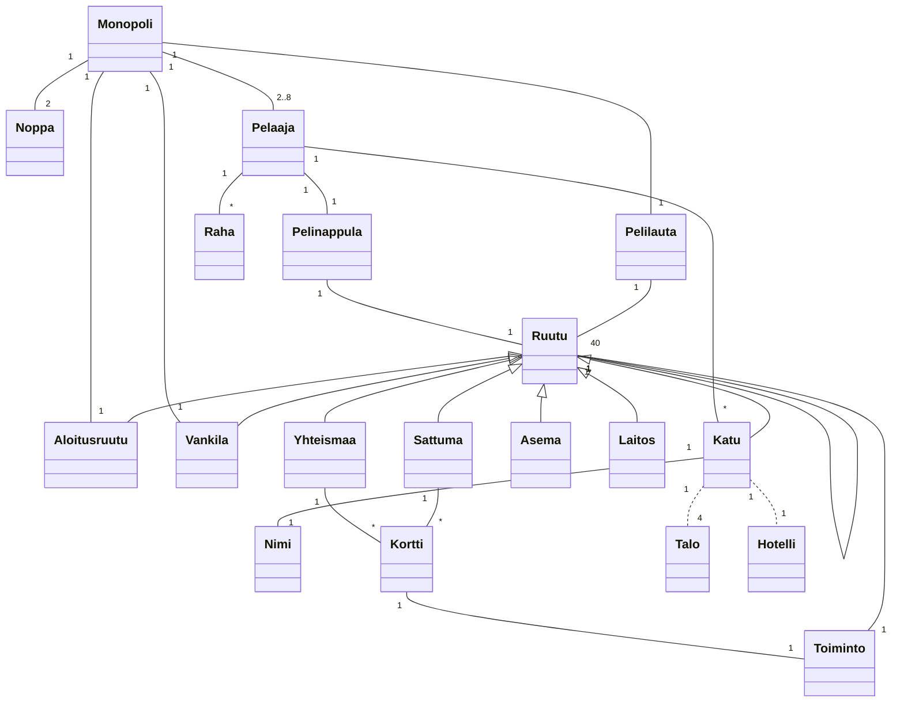

```mermaid
classDiagram
Monopoli "1" -- "2" Noppa
Monopoli "1" -- "1" Pelilauta
Monopoli "1" -- "2..8" Pelaaja
Pelilauta "1" -- "40" Ruutu
Ruutu "1" -- "1" Ruutu
Pelaaja "1" -- "1" Pelinappula
Pelinappula "1" -- "1" Ruutu
Ruutu <|-- Aloitusruutu
Ruutu <|-- Vankila
Ruutu <|-- Sattuma
Ruutu <|-- Yhteismaa
Ruutu <|-- Asema
Ruutu <|-- Laitos
Ruutu <|-- Katu
Katu "1" -- "1" Nimi
Monopoli "1" -- "1" Aloitusruutu
Monopoli "1" -- "1" Vankila
Ruutu "1" -- "1" Toiminto
Kortti "1" -- "1" Toiminto
Sattuma "1" -- "*" Kortti
Yhteismaa "1" -- "*" Kortti
Katu "1" .. "4" Talo
Katu "1" .. "1" Hotelli
Pelaaja "1" -- "*" Katu
Pelaaja "1" -- "*" Raha

```
