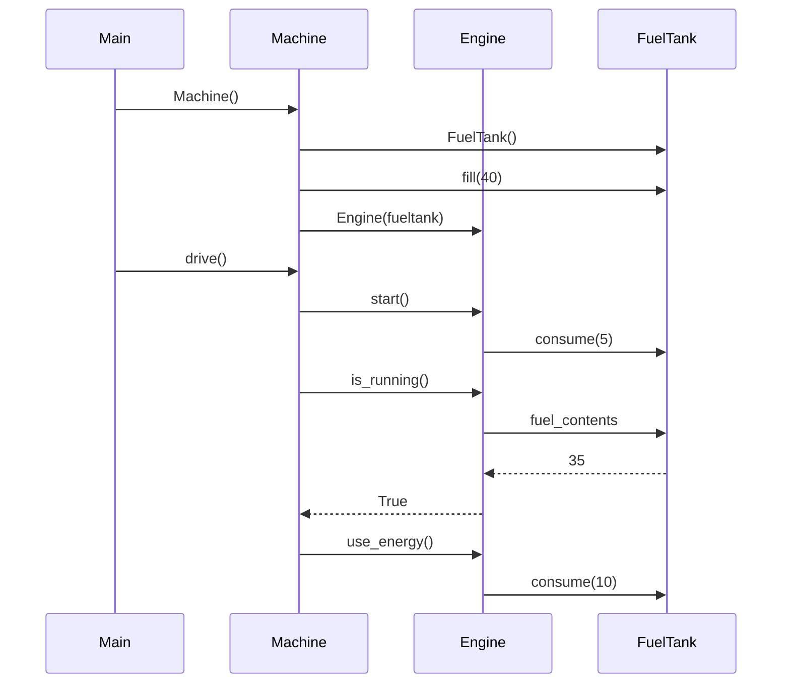

```mermaid
sequenceDiagram
	participant Ma as Main
	participant M as Machine
	participant E as Engine
	participant F as FuelTank

	Ma->>M: Machine()
	M->>F: FuelTank()
	M->>F: fill(40)
	M->>E: Engine(fueltank)
	Ma->>M: drive()
	M->>E: start()
	E->>F: consume(5)
	M->>E: is_running()
	E->>F: fuel_contents
	F-->>E: 35
	E-->>M: True
	M->>E: use_energy()
	E->>F: consume(10)
```
