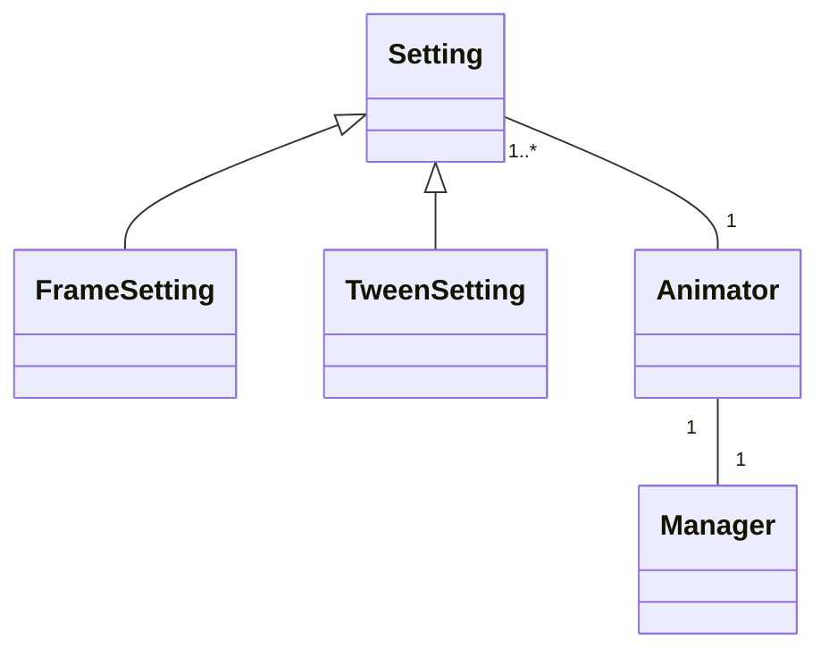

# Ohjelman rakenteen luokkakaavio



# Animaation käyntiinlaitto sekvenssikaavio

```mermaid
sequenceDiagram
mainloop->>play: animator.play()
activate play
play->>animate: animator.animate()
activate animate
animate->>frame: animator.frame(animator.time)
activate frame
frame->>position: manager.position(...)
activate position
deactivate position
deactivate frame
frame-->>animate: True
animate->>schedule: manager.schedule(animator.animate)
activate schedule
deactivate schedule
deactivate animate
mainloop->>animate
activate animate
´´´
