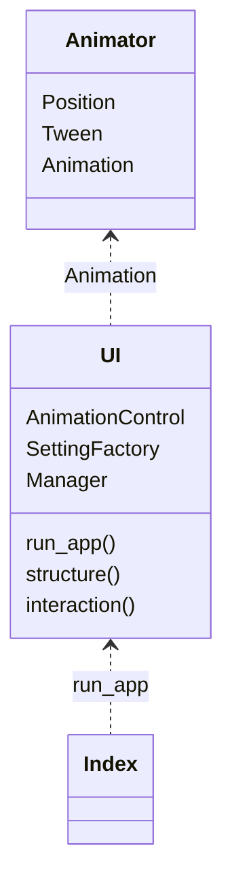
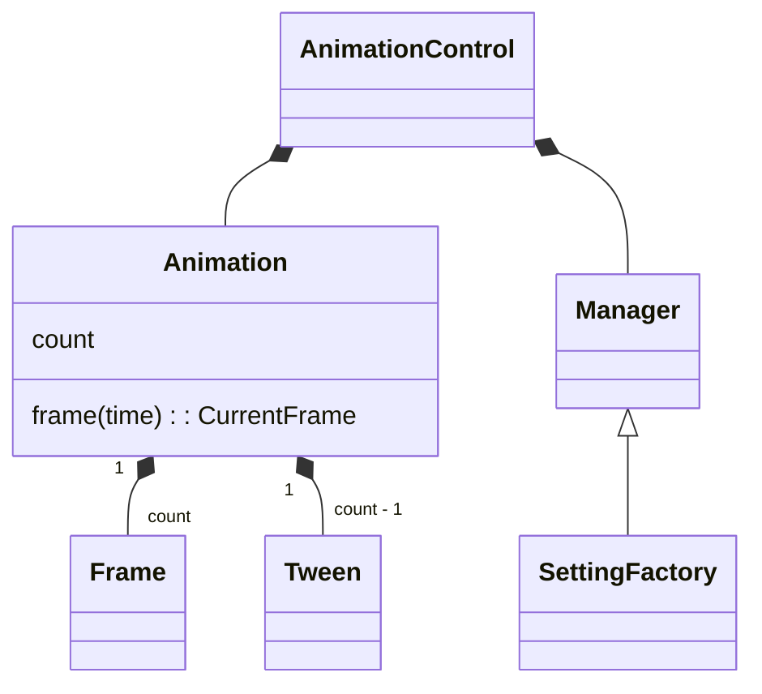
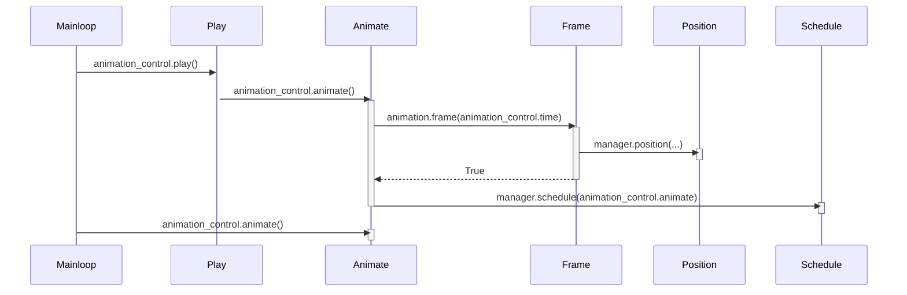

# Pakkauskaavio

```mermaid
classDiagram
    class UI {
        run_app()
        structure()
        interaction()
        AnimationControl
        SettingFactory
        Manager
    }
    class Animator {
        Position
        Tween
        Animation
    }
    UI <.. Index : run_app
    Animator <.. UI : Animation
```

# Ohjelman rakenteen luokkakaavio

```mermaid
classDiagram
    AnimationControl *-- Animation
    AnimationControl *-- Manager
    Manager <|-- SettingFactory
    class Animation {
        count
        frame(time): CurrentFrame
    }
    Animation "1" *-- "count" Frame
    Animation "1" *-- "count - 1" Tween
```

# Animaation käyntiinlaitto sekvenssikaavio

```mermaid
sequenceDiagram
        participant Mainloop
        participant Play
        participant Animate
        participant Frame
        participant Position
        participant Schedule

        Mainloop->>Play: animation_control.play()
        activate Play
        Play->>Animate: animation_control.animate()
        activate Animate
        Animate->>Frame: animation.frame(animation_control.time)
        activate Frame
        Frame->>Position: manager.position(...)
        activate Position
        deactivate Position
        Frame-->>Animate: True
        deactivate Frame
        Animate->>Schedule: manager.schedule(animation_control.animate)
        activate Schedule
        deactivate Schedule
        deactivate Animate
        Mainloop->>Animate: animation_control.animate()
        activate Animate
        deactivate Animate
```
