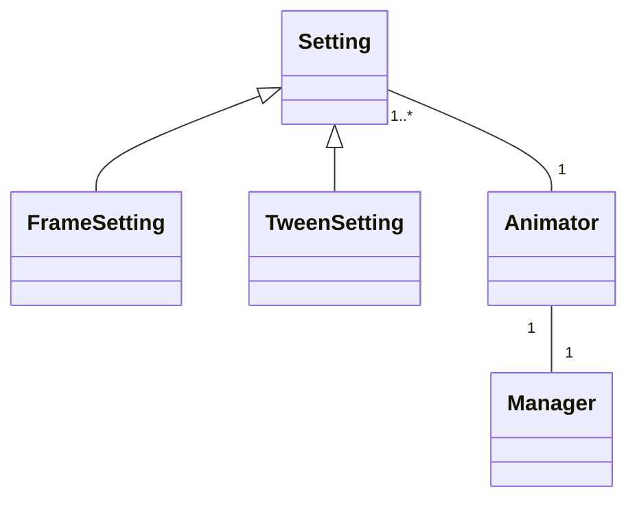

# Ohjelman rakenteen luokkakaavio



# Animaation käyntiinlaitto sekvenssikaavio

```mermaid
sequenceDiagram
Mainloop->>Play: animator.play()
activate Play
Play->>Animate: animator.animate()
activate Animate
Animate->>Frame: animator.frame(animator.time)
activate Frame
Frame->>Position: manager.position(...)
activate Position
deactivate Position
deactivate Frame
Frame-->>Animate: True
Animate->>Schedule: manager.schedule(animator.animate)
activate Schedule
deactivate Schedule
deactivate Animate
Mainloop->>Animate
activate Animate
´´´
