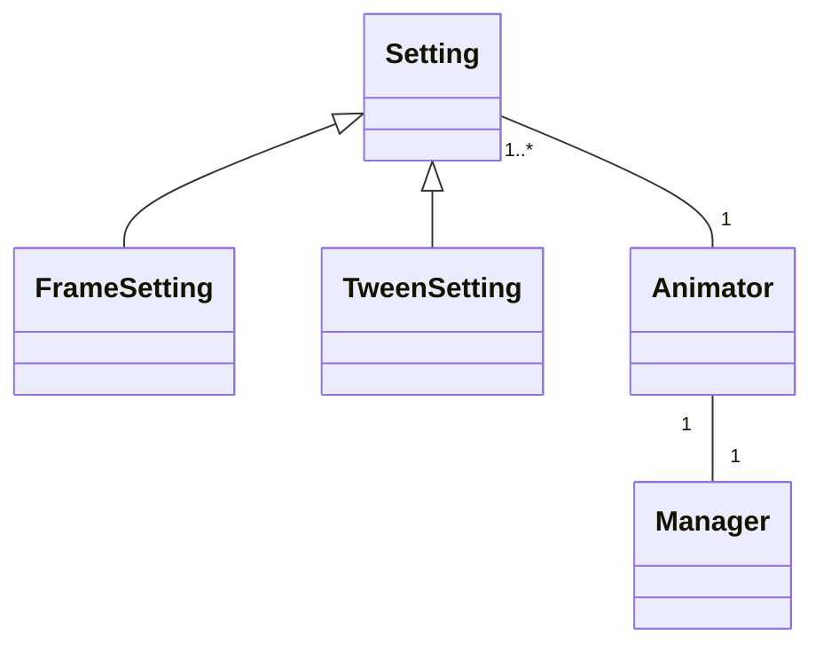

# Ohjelman rakenteen luokkakaavio



# Animaation käyntiinlaitto sekvenssikaavio

```mermaid
sequenceDiagram
	participant Mainloop
	participant Animate
	participant Frame
	participant Position
	participant Schedule
	participant Play

	Mainloop->>Play: animator.play()
	activate Play
	Play->>Animate: animator.animate()
	activate Animate
	deactivate Animate
	Mainloop->>Animate: animator.animate()
	activate Animate
	deactivate Animate
´´´
