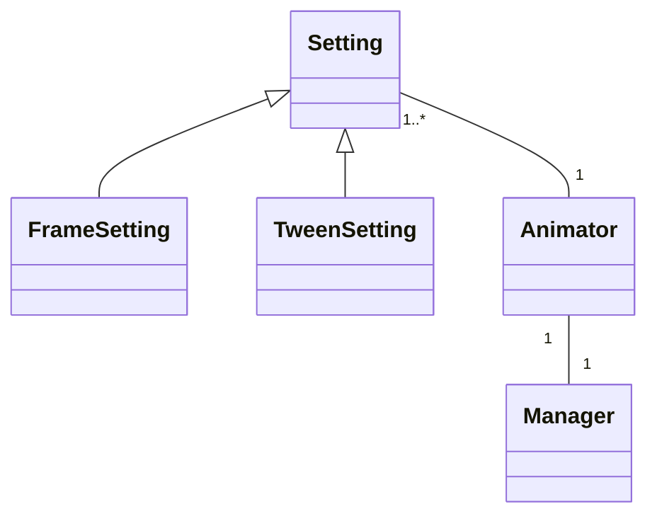
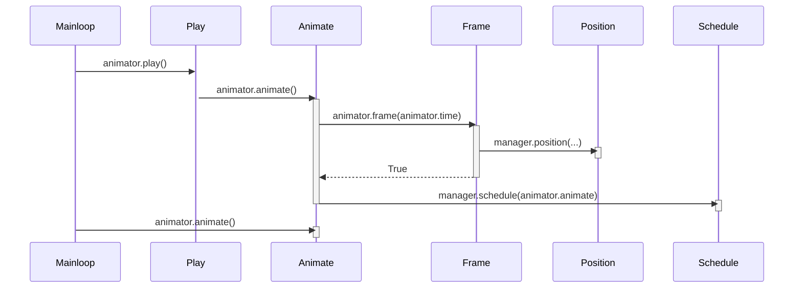

# Ohjelman rakenteen luokkakaavio

```mermaid
classDiagram
Setting <|-- FrameSetting
Setting <|-- TweenSetting
Setting "1..*" -- "1" Animator
Animator "1" -- "1" Manager
```

# Animaation käyntiinlaitto sekvenssikaavio

```mermaid
sequenceDiagram
        participant Mainloop
        participant Play
        participant Animate
        participant Frame
        participant Position
        participant Schedule

        Mainloop->>Play: animator.play()
        activate Play
        Play->>Animate: animator.animate()
        activate Animate
        Animate->>Frame: animator.frame(animator.time)
        activate Frame
        Frame->>Position: manager.position(...)
        activate Position
        deactivate Position
        Frame-->>Animate: True
        deactivate Frame
        Animate->>Schedule: manager.schedule(animator.animate)
        activate Schedule
        deactivate Schedule
        deactivate Animate
        Mainloop->>Animate: animator.animate()
        activate Animate
        deactivate Animate
```
