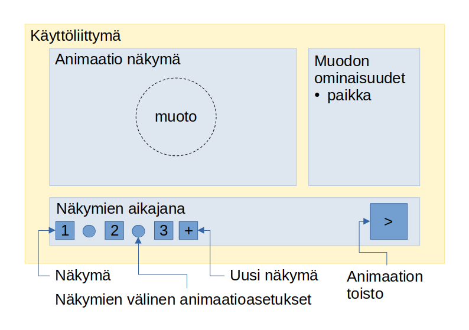

# Vaatimusmäärittely
Sovelluksella käyttäjän on mahdollista luoda animaatioita muodolle määrittelemällä liikeratoja. Liikeradat koostuvat sijainneista ja niiden välillä vaihtamis menetelmistä.

## Toiminnallisuudet
- [x] Muodolle voi määrittää sijainnit, joiden välillä muoto liikkuu animaation edetessä.
- [x] Sijaintien välille voi määritellä siirtymisiä
- [x] Animaation katsomisen voi toistaa
- [x] Animaatiossa voi siirtä katsomaan haluamaansa kohtaan ja muokkaamaan sitä

## Käyttöliittymäluonnos

